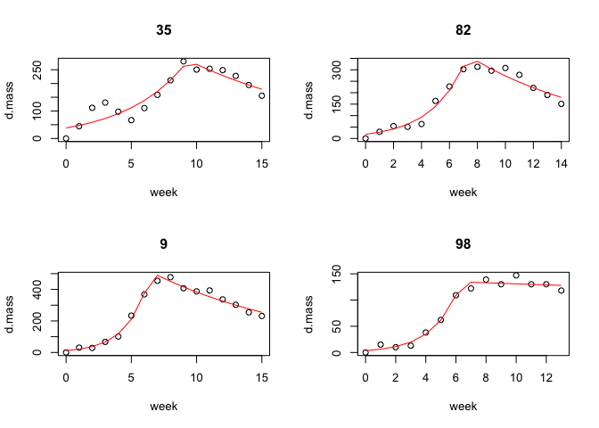

<!-- README.md is generated from README.Rmd. Please edit that file -->

# Tools for modeling bumblebee colony growth

<!-- badges: start -->

[](https://github.com/Aariq/bumbl/actions)
[](https://codecov.io/gh/Aariq/bumbl?branch=master)
[](https://www.tidyverse.org/lifecycle/#experimental)
[](https://CRAN.R-project.org/package=bumbl)

<!-- badges: end -->

`bumbl` implements a model for bumblebee colony growth described in
Crone and Williams 2016<sup>1</sup>. The `brkpt` function models colony
growth as having a change point at some time, *tau*, where the colony
switches from growth and worker production to gyne production. The
`bumbl` function applies this model to a data frame of data from
multiple colonies, allowing for each colony to have it’s own *tau* and
returns the original data augmented with coefficients from the
changepoint model.

This is still in very early development, so use at your own risk.

## Roadmap

  - [x] Write `bumbl()` function to model colony growth with switchpoint
  - [x] Finish documentation and vignette(s)
  - [ ] [rOpenSci
    review](https://github.com/ropenscilabs/statistical-software-review/issues/2)
  - [ ] Initial CRAN submission
  - [ ] Add integral projection model functions (in development on [ipm
    branch](https://github.com/Aariq/bumbl/tree/ipm))
  - [ ] Submit new major verson to CRAN

After this, I’m probably going to be looking for someone else to take
over maintenance and development. In the meantime, I welcome
contributions including bug-fixes, improvement of documentation,
additional features, or new functions relating to bumblebee ecology and
demography.

Possible areas of improvement that I don’t personally have time for:

  - Extend `bumbl()` to work with GLMMs
  - Better optimization function for finding the switchpoint in
    `bumbl()` (for inspiration, see
    [changepoint](https://github.com/rkillick/changepoint/))

## Installation

You can install this development version of `bumbl` with:

``` r
devtools::install_github("Aariq/bumbl", build_vignettes = TRUE)
```

## Getting started

View the package vignette with:

``` r
library(bumbl)
vignette("bumbl")
```

View the `bomubs` dataset

``` r
head(bombus)
#> # A tibble: 6 x 10
#>   site  colony  wild habitat date        week  mass d.mass floral_resources
#>   <fct> <fct>  <dbl> <fct>   <date>     <int> <dbl>  <dbl>            <dbl>
#> 1 PUT2  9       0.98 W       2003-04-03     0 1910.    0.1            27.8 
#> 2 PUT2  9       0.98 W       2003-04-09     1 1940    30.6            27.8 
#> 3 PUT2  9       0.98 W       2003-04-15     2 1938    28.6            27.8 
#> 4 PUT2  9       0.98 W       2003-04-22     3 1976.   67.1            27.8 
#> 5 PUT2  9       0.98 W       2003-05-01     4 2010.  101.              7.96
#> 6 PUT2  9       0.98 W       2003-05-07     5 2143   234.              7.96
#> # … with 1 more variable: cum_floral <dbl>
```

### Example use

Using a subset of the `bombus` dataframe to estimate the week (tau) that
colonies switch to reproduction

``` r
bombus2 <- bombus[bombus$colony %in% c(9, 82, 98, 35), ]
results <- bumbl(bombus2, colonyID = colony, t = week, formula = d.mass ~ week)
results
#> # A tibble: 4 x 7
#>   colony converged   tau logN0 logLam  decay logNmax
#>   <chr>  <lgl>     <dbl> <dbl>  <dbl>  <dbl>   <dbl>
#> 1 35     TRUE       9.49  3.68  0.209 -0.295    5.61
#> 2 82     TRUE       7.43  2.97  0.394 -0.503    5.83
#> 3 9      TRUE       6.43  2.30  0.610 -0.690    6.18
#> 4 98     TRUE       6.37  1.27  0.570 -0.578    4.90
```

Plot the results

``` r
par(mfrow = c(2, 2))
plot(results)
#> Creating plots for 4 colonies...
```



``` r
par(mfrow = c(1, 1))
```

# References

<sup>1</sup>Crone, E. E., and Williams, N. M. (2016). Bumble bee colony
dynamics: quantifying the importance of land use and floral resources
for colony growth and queen production. Ecol. Lett. 19, 460–468.
<https://doi.org/10.1111/ele.12581>

-----

Please note that the bumbl project is released with a [Contributor Code
of Conduct](CODE_OF_CONDUCT.md). By contributing to this project you
agree to abide by its terms.
